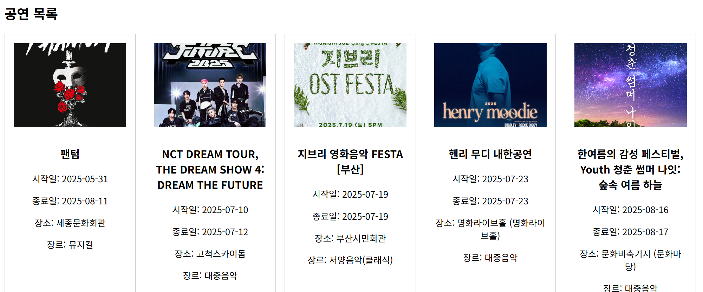
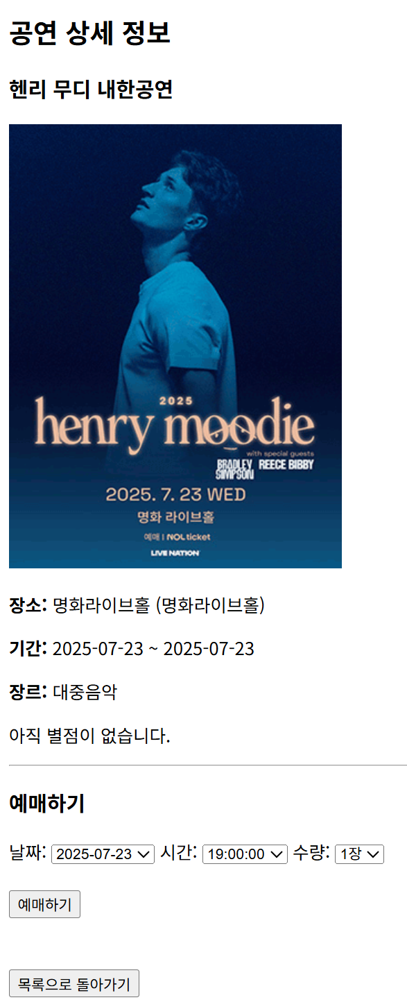
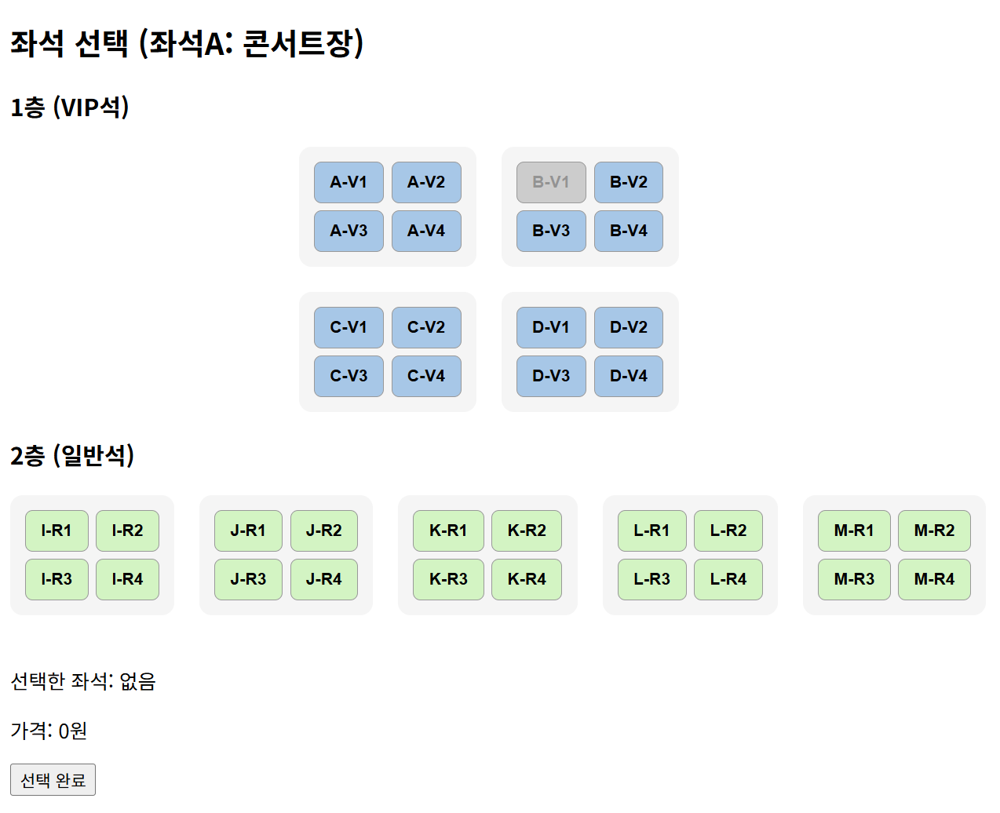
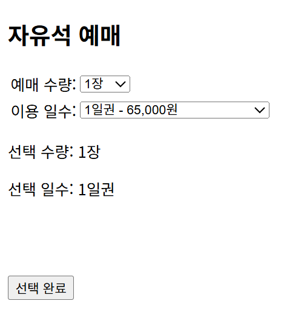
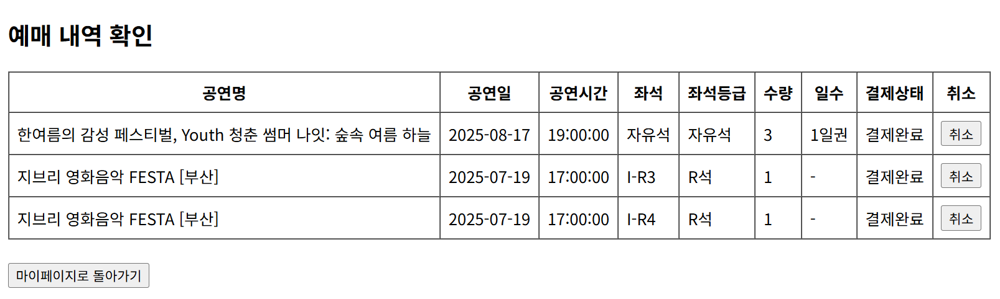
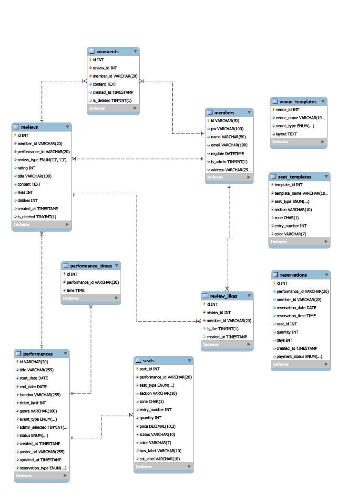

# PerFortival - Performance & Festival Reservation System

[2025-1] JSP_Web & App Application


> A performance and festival reservation web application built with JSP and Servlet.

<br>

JSP/Servlet 기반으로 구현한 공연 및 페스티벌 예매 시스템입니다.

공연 조회, 회원 인증, 예매 처리, 후기 게시판, 관리자 기능까지  
하나의 서비스 흐름으로 구성했습니다.

---

## Project Overview

PerFortival은 공연 및 페스티벌 예매 서비스의 핵심 흐름을 직접 구현하고 이해하기 위해 개발한 프로젝트입니다.

단순한 CRUD 중심 웹 프로젝트를 넘어서, 다음과 같은 핵심 기능을 포함했습니다.

* 회원가입 / 로그인 기반 사용자 인증
* 공연 목록 및 상세 조회
* 예매 처리 및 예매 내역 관리
* 후기 및 댓글 기능
* 관리자 기능을 통한 운영 관리

JSP/Servlet 기반 MVC 웹 애플리케이션의 전체 구조를 직접 설계하고 구현하는 데 초점을 두었습니다.

---

## Learning Goals

* JSP / Servlet 기반 웹 애플리케이션의 전체 흐름 이해
* 도메인별 패키지 분리를 통한 MVC 구조 학습
* 예매 중심 서비스 로직 구현
* 사용자 기능과 관리자 기능을 분리한 구조 설계
* DB 연동 기반 CRUD 흐름 전반 구현

---

## Key Features

### 1. Member

* 회원가입
* 로그인 / 로그아웃
* 세션 기반 사용자 인증
* 마이페이지

### 2. Performance

* 공연 목록 조회
* 공연 상세 조회
* 공연 검색 기능

### 3. Reservation

* 공연 예매 처리
* 예매 내역 조회
* 예매 취소 기능
* 예매 흐름에 따른 데이터 저장 및 상태 관리

### 4. Review

* 후기 작성 / 조회 / 수정 / 삭제
* 댓글 기능
* 사용자 참여형 게시판 구조 구현

### 5. Admin

* 관리자 전용 기능 분리
* 공연 검색 및 저장, 회차 등록
* 예매 로그 조회
* 후기 및 댓글 관리

---

## What I Focused On

### Reservation Type Branching

공연별 예매 유형에 따라 좌석형 / 자유석 등 예매 흐름이 달라지도록 분기 처리했습니다.  
예매 방식에 맞는 화면과 로직을 연결하여 하나의 서비스 안에서 다양한 티켓 유형을 처리할 수 있도록 구성했습니다.

### Free-ticket Reservation Logic

자유석 예매에서는 수량 선택뿐 아니라 이용 일수에 따른 요금 정책을 함께 반영했습니다.  
1일권, 2일권, 3일권으로 구성하고, 2일권과 3일권에는 할인 정책을 적용하여  
단순 수량 선택을 넘어 예매 조건 자체를 서비스 로직으로 구현했습니다.

### Domain-based Structure

회원, 공연, 예매, 후기, 관리자 기능을 도메인별로 분리하여  
기능이 많아져도 역할과 책임을 명확히 파악할 수 있도록 구성했습니다.

### Implementing MVC Flow with JSP / Servlet

프레임워크에 의존하지 않고   
요청 → Controller → DAO / Service → JSP 응답 흐름을 직접 구현하며   
웹 애플리케이션의 동작 원리를 구조적으로 이해하는 데 집중했습니다.

---

## System Structure

### Backend Package Structure

```text
src/main/java/com/perfortival
├── admin
│   └── controller
├── common
├── main
│   └── controller
├── member
├── performance
├── reservation
└── review
```

### Web Structure

```text
src/main/webapp
├── META-INF
├── WEB-INF
└── error.jsp
```

---

## Tech Stack

### Backend

* Java 17
* Servlet
* JSP
* JSTL

### Database

* MySQL

### Frontend

* HTML5
* CSS3
* JavaScript

### Server / Environment

* Apache Tomcat

### Version Control

* Git
* GitHub

---

## Project Flow

### User Flow

1. 회원가입 및 로그인
2. 공연 목록 조회
3. 공연 상세 페이지 확인
4. 예매 진행
5. 예매 내역 확인 및 관리
6. 후기 및 댓글 작성

### Admin Flow

1. 관리자 페이지 진입
2. 공연 등록 및 관리
3. 예매 관련 데이터 확인
4. 후기 및 댓글 관리

---

## Setup

### 1. Clone Repository

```bash
git clone https://github.com/dPdms21/JSP_Performance-Festival-Reservation.git
```

### 2. Configure Environment

- Apache Tomcat 설정
- MySQL 데이터베이스 생성
- `DBUtil.java`의 DB 연결 정보를 로컬 환경에 맞게 설정
- 외부 API 사용 시 `config.properties`에 `API_KEY` 설정

### 3. Run Project

- Tomcat 서버에 프로젝트를 배포한 뒤 실행

---

## Screenshots

### 1. Performance List

공연 및 페스티벌 목록을 조회할 수 있는 화면입니다.  
등록된 공연 정보를 한눈에 확인할 수 있도록 구성했습니다.



---

### 2. Performance Detail

공연 상세 정보와 예매에 필요한 날짜, 시간, 수량 정보를 선택할 수 있는 화면입니다.



---

### 3. Seat Selection

공연 유형에 따라 좌석 선택 방식이 달라지도록 구성했으며,  
좌석형 공연에서는 좌석 등급과 배치에 따라 예매를 진행할 수 있습니다.



---

### 4. Free-ticket Reservation

자유석 예매 화면으로, 예매 수량과 이용 일수를 선택할 수 있도록 구현했습니다.  
1일권, 2일권, 3일권에 따른 요금 정책도 함께 반영했습니다.



---

### 5. Reservation History

마이페이지에서 사용자의 예매 내역을 확인하고, 예매 상태를 조회할 수 있는 화면입니다.



---

## ERD

PerFortival의 데이터 구조는 회원, 공연, 회차, 좌석, 예매, 후기, 댓글을 중심으로 설계했습니다.  
공연 조회부터 예매, 예매 내역 관리, 후기 작성까지 하나의 서비스 흐름이 DB 구조와 연결되도록 구성했습니다.



---

## Author

Yeeun Park

GitHub: [dPdms21](https://github.com/dPdms21)
